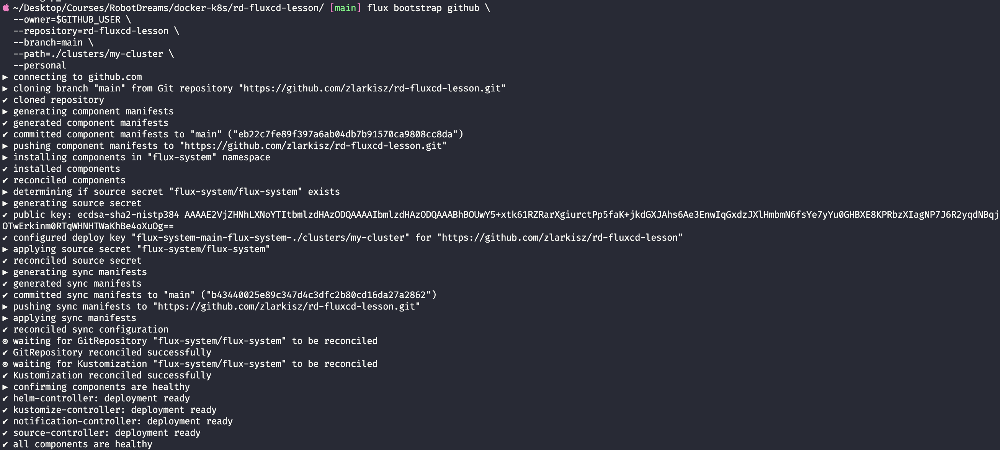
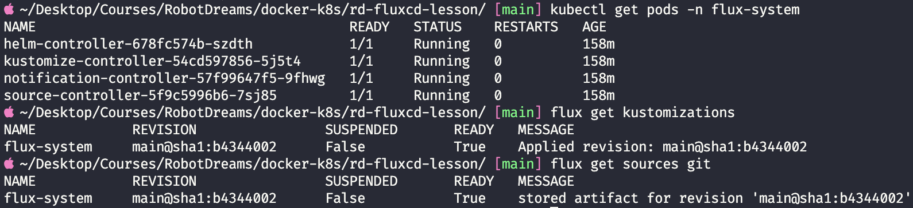
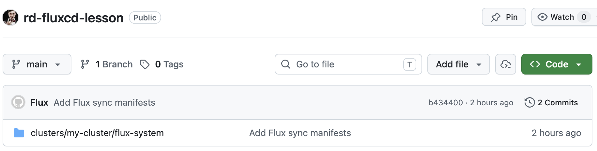
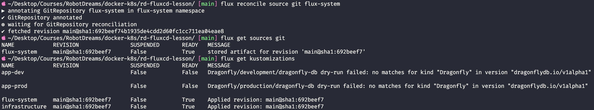
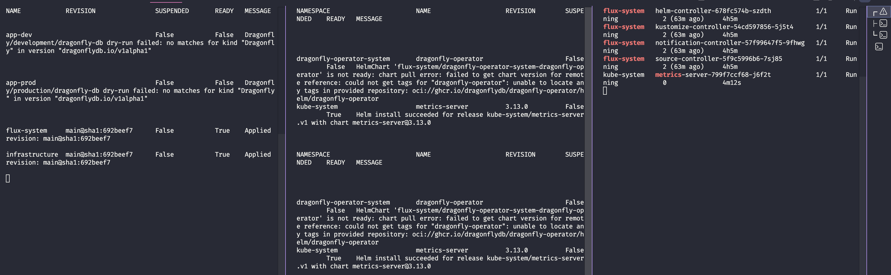
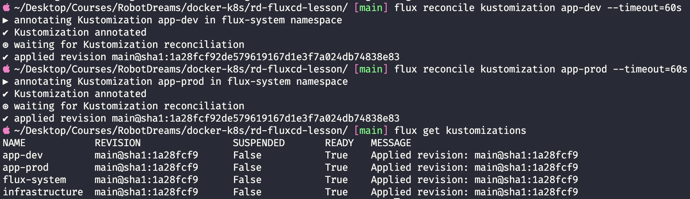
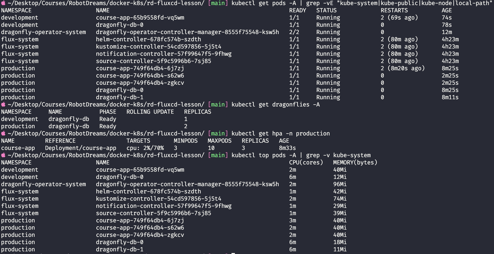
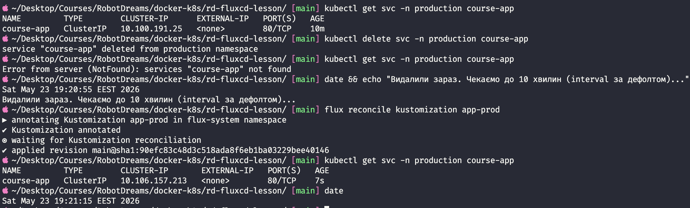
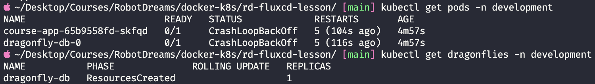

# rd-fluxcd-lesson — GitOps з FluxCD

> **Курс:** Robot Dreams · Docker and Kubernetes · Oleg Zarevych
> **Домашка:** #12 — GitOps підхід, утиліта FluxCD
> **Автор:** [@zlarkisz](https://github.com/zlarkisz)

Реалізація повного GitOps-циклу: від bootstrap Flux до автоматичного розгортання мульти-середовищного кластера (`development` + `production`) з Dragonfly БД через Operator Pattern і HPA на основі metrics-server.

**Усе керується через Git.** Жодного `kubectl apply` чи `helm install` руками — кожна зміна йде через `git push`, Flux у кластері сам її підхоплює і застосовує.

---

## Зміст

- [Середовище](#середовище)
- [Архітектура](#архітектура)
- [Етап 1 — Підготовка інфраструктури (Flux Bootstrap)](#етап-1--підготовка-інфраструктури-flux-bootstrap)
- [Етап 2 — Архітектура застосунку (Kustomize Base)](#етап-2--архітектура-застосунку-kustomize-base)
- [Етап 3 — Середовище Development (Overlay)](#етап-3--середовище-development-overlay)
- [Етап 4 — Середовище Production (Overlay)](#етап-4--середовище-production-overlay)
- [Бонусне — Інфраструктура через GitOps](#бонусне--інфраструктура-через-gitops)
- [Етап 5 — Вмикаємо GitOps](#етап-5--вмикаємо-gitops)
- [Definition of Done — Перевірка](#definition-of-done--перевірка)
- [Drift Check](#drift-check)
- [Проблеми та їх вирішення](#проблеми-та-їх-вирішення)
- [Висновки](#висновки)

---

## Середовище

| Параметр       | Значення                                |
| -------------- | --------------------------------------- |
| OS             | macOS (Apple Silicon, arm64)            |
| Kubernetes     | Docker Desktop, v1.34.1 (control-plane) |
| Flux CD        | v2.8.8                                  |
| Shell          | zsh                                     |
| Дата виконання | 23 травня 2026                          |

---

## Архітектура

GitOps цикл реалізовано за принципом **pull-моделі**: Flux у кластері періодично читає Git-репозиторій і застосовує зміни. Жодного `kubectl apply` чи `helm install` руками — все через `git push`.

```
┌─────────────────┐    git push     ┌──────────────┐
│   Розробник     │ ───────────────▶│    GitHub    │
└─────────────────┘                 │ (rd-fluxcd-  │
                                    │   lesson)    │
                                    └──────┬───────┘
                                           │ poll (1m)
                                           ▼
                                    ┌───────────────┐
                                    │     Flux      │
                                    │  source-ctrl  │
                                    │ kustomize-ctrl│
                                    │  helm-ctrl    │
                                    └──────┬────────┘
                                           │ apply
                                           ▼
                                    ┌──────────────┐
                                    │  Kubernetes  │
                                    │   (Docker    │
                                    │   Desktop)   │
                                    └──────────────┘
```

### Структура репозиторію

```
rd-fluxcd-lesson/
├── README.md                             # цей файл
├── screenshots/                          # скріни процесу (не сканується Flux)
│
├── clusters/my-cluster/                  # ← bootstrap створив + наші Flux Kustomization
│   ├── flux-system/                      # самі контролери Flux (керує сам собою)
│   │   ├── gotk-components.yaml
│   │   ├── gotk-sync.yaml
│   │   └── kustomization.yaml
│   ├── infrastructure.yaml               # Flux Kustomization → ./infrastructure/controllers
│   ├── apps-dev.yaml                     # Flux Kustomization → ./apps/overlays/development
│   └── apps-prod.yaml                    # Flux Kustomization → ./apps/overlays/production
│                                         # (+ patch: ignore /spec/replicas для HPA)
│
├── apps/
│   ├── base/                             # канонічні маніфести
│   │   ├── deployment.yaml               # course-app, 1 репліка, env для Dragonfly
│   │   ├── service.yaml                  # ClusterIP 80→8080
│   │   ├── ingress.yaml                  # course-app.local
│   │   └── kustomization.yaml            # common labels
│   └── overlays/
│       ├── development/                  # dev-патчі
│       │   ├── namespace.yaml            # ns: development
│       │   ├── dragonfly.yaml            # 1 інстанс
│       │   └── kustomization.yaml        # namespace + patch replicas=1
│       └── production/                   # prod-патчі
│           ├── namespace.yaml            # ns: production
│           ├── dragonfly.yaml            # 2 інстанси (master + replica)
│           ├── hpa.yaml                  # HPA 3-10 по CPU 70%
│           └── kustomization.yaml        # namespace + patch resources requests/limits
│
└── infrastructure/
    └── controllers/                      # cluster-wide компоненти
        ├── kustomization.yaml            # агрегатор (dragonfly + metrics-server)
        ├── dragonfly/
        │   ├── dragonfly-operator.yaml   # консолідований маніфест (ghcr.io 403 для Helm)
        │   └── kustomization.yaml
        └── metrics-server/               # потрібен для HPA
            ├── repository.yaml           # HelmRepository (HTTP)
            ├── release.yaml              # HelmRelease + --kubelet-insecure-tls
            └── kustomization.yaml
```

> 💡 **Дві гілки `apps/` і `infrastructure/`** — конвенція з [офіційного flux2-kustomize-helm-example](https://github.com/fluxcd/flux2-kustomize-helm-example). Розділення дає можливість сказати Flux: "спочатку постав інфру, потім apps які від неї залежать" через `dependsOn`.

---

## Етап 1 — Підготовка інфраструктури (Flux Bootstrap)

### Що таке GitOps і Flux

GitOps — **Git стає єдиним джерелом правди для стану кластера**. Замість push-моделі (CI пушить у кластер) тут pull-модель: агент у кластері сам тягне з Git. Безпечніше — кластер не світить доступи назовні.

Flux CD складається з 4 контролерів:

- **source-controller** — ходить у Git/Helm репозиторії і скачує
- **kustomize-controller** — застосовує Kustomize-маніфести
- **helm-controller** — встановлює Helm чарти
- **notification-controller** — алерти, веб-хуки

> 💡 **Аналогія:** Git — стіл архітектора з кресленнями. Flux — бригадир, який кожну хвилину бігає до столу і переробляє будівлю під нові креслення. Хтось вночі висадить вікно (drift) — бригадир вранці побачить розбіжність і вставить нове.

### Що робить `flux bootstrap`

Команда робить **три речі одночасно**:

1. **Встановлює Flux у кластер** (4 контролери в `flux-system` namespace)
2. **Створює маніфести Flux у твоєму Git-репо** в папці `clusters/my-cluster/flux-system/`
3. **Налаштовує Flux слідкувати за цією папкою** — `GitRepository` + `Kustomization`

Після bootstrap Flux **сам себе оновлює через Git** — рекурсивна магія GitOps.

### Команда

```bash
export GITHUB_USER=zlarkisz
export GITHUB_TOKEN=ghp_xxxxxxxxxxxxxxxxxxxxxxxx

flux bootstrap github \
  --owner=$GITHUB_USER \
  --repository=rd-fluxcd-lesson \
  --branch=main \
  --path=./clusters/my-cluster \
  --personal
```

| Прапорець      | Значення                                              |
| -------------- | ----------------------------------------------------- |
| `--owner`      | GitHub username                                       |
| `--repository` | Назва репо (створиться якщо немає)                    |
| `--branch`     | Гілка, з якої Flux читає                              |
| `--path`       | Папка в репо, що належить цьому кластеру (convention) |
| `--personal`   | Особистий репо (не організація)                       |

### Результат



Bootstrap пройшов усі кроки: cloned → installed components → generated SSH key → configured deploy key in GitHub → applying sync → **all components are healthy**.

### Перевірка після bootstrap



- ✅ 4 контролери Flux в `Running`
- ✅ `flux-system` Kustomization у статусі `True`
- ✅ `flux-system` GitRepository зберігає артефакт

### Стан GitHub репозиторію



У репо з'явилася папка `clusters/my-cluster/flux-system/` з трьома файлами (`gotk-components.yaml`, `gotk-sync.yaml`, `kustomization.yaml`).

> 💡 `gotk` = **G**it**O**ps **T**ool**k**it — так офіційно називається набір контролерів Flux.

---

## Етап 2 — Архітектура застосунку (Kustomize Base)

### Що таке Kustomize і навіщо

**Kustomize** — інструмент управління K8s маніфестами **без шаблонізації** (на відміну від Helm з Go templates). Філософія: маєш "чисті" YAML в `base/`, а зміни для конкретних середовищ описуєш як **патчі** в `overlays/`.

> 💡 **Аналогія:** `base` — рецепт борщу в кулінарній книзі. Готуєш для вегетаріанця → накладаєш стікер "м'ясо → не клади". На 20 людей → стікер "помнож на 4". Сам рецепт у книзі не змінюється.

**Чому Kustomize, а не Helm у цій домашці:** ТЗ прямо вимагає; у Flux Kustomize це первинний клас (контролер так і називається `kustomize-controller`); вбудовано в `kubectl` (`kubectl apply -k`).

### Принципи для `base`

- НІЯКИХ `namespace` у маніфестах — задається у overlay
- НІЯКИХ `resources` requests/limits — це специфіка production
- НІЯКИХ `Dragonfly` CR — це деталь середовища
- Все **загальне**, що буде однаковим скрізь

### Файли base

**`apps/base/deployment.yaml`** — Deployment з 1 реплікою, image `zlarkisz/course-app:1.0.1`, env `APP_REDIS_URL=redis://dragonfly-db:6379` (підключення до Dragonfly Service).

**`apps/base/service.yaml`** — ClusterIP на порту 80 → `targetPort: http` (іменований порт з Deployment).

> 💡 Іменовані порти — best practice. Якщо завтра контейнер почне слухати інший порт — змінюєш тільки `Deployment.containerPort`, Service автоматично знайде його за іменем.

**`apps/base/ingress.yaml`** — Ingress на `course-app.local`, `ingressClassName: nginx`.

**`apps/base/kustomization.yaml`** — об'єднує три файли вище + додає `common labels`:

```yaml
labels:
  - pairs:
      app.kubernetes.io/part-of: course-app
      app.kubernetes.io/managed-by: flux
```

### Валідація

```bash
kubectl kustomize apps/base/
```

Вивів 3 ресурси (Deployment + Service + Ingress) з доданими labels — base валідний.

---

## Етап 3 — Середовище Development (Overlay)

### Як працює overlay

**Overlay** — папка з власним `kustomization.yaml`, який:

1. Посилається на `base/` через `resources: - ../../base`
2. **Патчить** окремі поля
3. **Додає** свої ресурси (Namespace, Dragonfly CR)

### Файли development

**`apps/overlays/development/namespace.yaml`** — створює Namespace `development`.

> 💡 Чому окремим ресурсом? Поле `namespace: development` у `kustomization.yaml` **призначає** namespace всім ресурсам, але **не створює** сам Namespace. Без явного `Namespace` об'єкту apply падає з "namespace not found".

**`apps/overlays/development/dragonfly.yaml`** — Custom Resource `kind: Dragonfly` з `replicas: 1`, image `dragonfly:latest`. Сам по собі CR нічого не запускає — Dragonfly Operator побачить його і створить StatefulSet + Pods + Service.

> ⚠️ Memory ≥ 384Mi обов'язково (детально — [у розділі проблем](#проблема-1--dragonfly-oom-у-development)).

**`apps/overlays/development/kustomization.yaml`** — найважливіший:

```yaml
namespace: development # Kustomize пропише цей ns всім ресурсам

resources:
  - ../../base # підтягує deployment, service, ingress з base
  - namespace.yaml # створює сам Namespace
  - dragonfly.yaml # Dragonfly CR

labels:
  - pairs:
      environment: development

patches:
  - target:
      kind: Deployment
      name: course-app
    patch: |-
      - op: replace
        path: /spec/replicas
        value: 1
```

### Валідація

`kubectl kustomize apps/overlays/development/` вивів **5 ресурсів**: Namespace, Service, Deployment, Dragonfly, Ingress. Усі (крім cluster-scoped Namespace) отримали `namespace: development` автоматично. Labels з base + з overlay об'єдналися.

---

## Етап 4 — Середовище Production (Overlay)

### Що складніше у production

| Вимога                    | Реалізація                                      |
| ------------------------- | ----------------------------------------------- |
| Namespace `production`    | `namespace.yaml`                                |
| 3 репліки застосунку      | Керує HPA (від 3 до 10), не статично            |
| 2 репліки Dragonfly       | `dragonfly.yaml` з `replicas: 2`                |
| Resources requests/limits | Patch у `kustomization.yaml` (потрібно для HPA) |
| HPA 3-10 копій            | `hpa.yaml` з target CPU 70%                     |

### HPA — кілька слів

**HorizontalPodAutoscaler** автоматично змінює кількість реплік залежно від навантаження.

> 💡 **Аналогія:** Ресторан. 3 офіціанти на старті (`minReplicas`). 50 столиків → менеджер дзвонить підкріпленню, поки не стане 10 (`maxReplicas`). Розійшлися → відправляє додому, лишається 3.

⚠️ **HPA може працювати тільки якщо у Deployment прописані `resources.requests.cpu`** — без цього HPA не знає, що таке "100% CPU". Тому requests і HPA йдуть парою.

⚠️ HPA читає метрики від `metrics-server`. У Docker Desktop він **не встановлений за замовчуванням** — встановлено через Flux ([див. бонусне](#бонусне--інфраструктура-через-gitops)).

### Файли production

**`apps/overlays/production/dragonfly.yaml`** — 2 інстанси (master + replica), `memory: 512Mi requests / 1Gi limits`.

**`apps/overlays/production/hpa.yaml`** — HPA з `minReplicas: 3`, `maxReplicas: 10`, target CPU 70%. Додано `behavior` (best practice):

- **scale-up швидкий** (60s stabilization) — реагуємо на сплеск
- **scale-down повільний** (300s stabilization, max -50% за раз) — не "пилкоподібний" графік

**`apps/overlays/production/kustomization.yaml`** — patch додає `resources` до контейнера через strategic merge patch (не JSON patch, бо тут зручніше додавати вкладені поля по імені контейнера):

```yaml
patches:
  - target:
      kind: Deployment
      name: course-app
    patch: |-
      apiVersion: apps/v1
      kind: Deployment
      metadata:
        name: course-app
      spec:
        template:
          spec:
            containers:
              - name: course-app
                resources:
                  requests:
                    cpu: "100m"
                    memory: "128Mi"
                  limits:
                    cpu: "500m"
                    memory: "256Mi"
```

### Чому в prod НЕ ставимо `replicas` через patch

**Це критично важлива пастка GitOps + HPA**: якщо у Git замість HPA фігурує `replicas: 3`, kustomize-controller буде кожні 10 хвилин виправляти "А скільки реплік? Має бути 3" і скейлити вниз. HPA одразу скейлить назад до 10. Нескінченний **flapping**.

Розв'язання — на рівні **Flux Kustomization** додаємо patch `op: remove /spec/replicas` (зроблено в `clusters/my-cluster/apps-prod.yaml`, Етап 5). Тоді HPA — єдиний власник цього поля.

### Валідація

`kubectl kustomize apps/overlays/production/` вивів **6 ресурсів** (5 з dev + HPA). Усі коректні: HPA має `min=3 max=10`, Deployment має `resources.requests.cpu=100m`, Dragonfly має `replicas: 2`.

---

## Бонусне — Інфраструктура через GitOps

ТЗ дозволяє ставити Dragonfly Operator руками, але це порушує філософію GitOps. Тому весь стек кластерної інфри теж керується через Flux.

### Dragonfly Operator (через консолідований маніфест)

> ⚠️ **Чому не Helm:** офіційний OCI Helm chart `oci://ghcr.io/dragonflydb/dragonfly-operator/helm` повертає **403 denied** для anonymous pull. Підтверджена проблема: [issue #236](https://github.com/dragonflydb/dragonfly-operator/issues/236).
>
> Тому використано рекомендований у README спосіб: офіційний консолідований маніфест (`manifests/dragonfly-operator.yaml`), збережений локально в репо. Це навіть **краще для GitOps** — версія застосунку фіксована в Git, ніяких сюрпризів від оновлень upstream.

**`infrastructure/controllers/dragonfly/dragonfly-operator.yaml`** — 456KB офіційного маніфесту: Namespace + CRD `dragonflies.dragonflydb.io` + ServiceAccount + RBAC + Deployment.

**`infrastructure/controllers/dragonfly/kustomization.yaml`** — просто підтягує цей файл.

### Metrics-server (через Helm)

Потрібен для HPA. Тут OCI працює нормально.

**`infrastructure/controllers/metrics-server/repository.yaml`** — `HelmRepository` (HTTP) на `https://kubernetes-sigs.github.io/metrics-server/`.

**`infrastructure/controllers/metrics-server/release.yaml`** — `HelmRelease` версії `3.x` з ключовим values:

```yaml
values:
  args:
    - --kubelet-insecure-tls # обов'язково для Docker Desktop (self-signed kubelet cert)
```

> 💡 Без `--kubelet-insecure-tls` metrics-server не довіряє self-signed серту kubelet у Docker Desktop → метрики не зчитуються → HPA показує `<unknown>`. У реальному prod-кластері цей флаг **не ставлять**.

### Агрегатор

**`infrastructure/controllers/kustomization.yaml`** — точка входу для Flux:

```yaml
resources:
  - dragonfly # Dragonfly Operator (для apps/overlays/*)
  - metrics-server # для HPA в production
```

---

## Етап 5 — Вмикаємо GitOps

### Що таке Flux Kustomization vs Kustomize Kustomization

Два різних об'єкти з однаковою назвою (джерело плутанини всюди):

| Kind                      | apiVersion                        | Що це                                         |
| ------------------------- | --------------------------------- | --------------------------------------------- |
| Kustomization (Kustomize) | `kustomize.config.k8s.io/v1beta1` | "Зміст" для Kustomize-рендерера (файл у Git)  |
| Kustomization (Flux)      | `kustomize.toolkit.fluxcd.io/v1`  | **Інструкція Flux-у** "застосуй ось ту папку" |

Файли в `clusters/my-cluster/*.yaml` — це саме **Flux Kustomization**.

### `infrastructure.yaml`

```yaml
apiVersion: kustomize.toolkit.fluxcd.io/v1
kind: Kustomization
metadata:
  name: infrastructure
  namespace: flux-system
spec:
  interval: 10m
  sourceRef:
    kind: GitRepository
    name: flux-system # створений bootstrap'ом, посилається на наш репо
  path: ./infrastructure/controllers
  prune: true # видалив файл з Git → Flux видалить ресурс
  retryInterval: 1m
  timeout: 5m
```

### `apps-dev.yaml` і `apps-prod.yaml`

Аналогічні, але з `path: ./apps/overlays/development` (або `production`) і обов'язково:

```yaml
dependsOn:
  - name: infrastructure # чекаємо CRD Dragonfly і metrics-server
```

Без `dependsOn` apps-dev спробує apply Dragonfly CR до того як CRD зареєстрована → провал з `no matches for kind Dragonfly`.

### `apps-prod.yaml` — особливо: ignore replicas

```yaml
patches:
  - target:
      kind: Deployment
      name: course-app
      namespace: production
    patch: |-
      - op: remove
        path: /spec/replicas
```

> 💡 Це **post-processing patch** на рівні Flux (а не Kustomize). Працює на **уже рендереному маніфесті** перед apply в кластер. Видаляє поле `replicas` зі своїх даних → HPA єдиний управляє цим полем → no flapping.

### Спочатку було неправильно

При першому push'і всі 4 Kustomization з'явилися, але apps-dev/apps-prod провалилися: dragonfly CRD ще не була зареєстрована.





Після переходу з Helm на консолідований маніфест для Dragonfly Operator — все запрацювало:



---

## Definition of Done — Перевірка

### Чек-лист з ТЗ

| #   | Вимога                                                                                       | Статус |
| --- | -------------------------------------------------------------------------------------------- | ------ |
| 1   | У GitHub репо є структура `base`, `overlays`, `clusters`                                     | ✅     |
| 2   | `flux get kustomizations` показує всі Ready (flux-system, infrastructure, app-dev, app-prod) | ✅     |
| 3   | У кластері існують namespaces `development` і `production`                                   | ✅     |
| 4   | В `development` запущено 1 под застосунку + Dragonfly через оператор                         | ✅     |
| 5   | В `production` запущено 3 поди застосунку, Dragonfly кластер з 2 реплік                      | ✅     |
| 6   | В `production` працює HPA                                                                    | ✅     |
| 7   | Drift Check: видалення сервісу руками → Flux відновлює протягом хвилини                      | ✅     |

### Повний стан кластера



Детальний розбір:

| Namespace                   | Що там                           | Статус            |
| --------------------------- | -------------------------------- | ----------------- |
| `development`               | course-app × 1, dragonfly-db × 1 | 1/1 + 1/1 Running |
| `production`                | course-app × 3, dragonfly-db × 2 | 3/3 + 2/2 Running |
| `dragonfly-operator-system` | operator-controller-manager      | 2/2 Running       |
| `flux-system`               | 4 контролери Flux                | 4/4 Running       |
| (kube-system)               | metrics-server                   | 1/1 Running       |

### HPA в дії

```
NAME         REFERENCE                TARGETS       MINPODS   MAXPODS   REPLICAS   AGE
course-app   Deployment/course-app    cpu: 2%/70%   3         10        3          8m33s
```

- ✅ Metrics-server реально віддає `cpu: 2%`
- ✅ HPA сам підняв з 1 (з base) до 3 (`minReplicas`)
- ✅ `kubectl top pods -A` показує метрики для всіх подів

### Dragonfly Operator у дії

```
NAMESPACE     NAME          PHASE   REPLICAS
development   dragonfly-db  Ready   1
production    dragonfly-db  Ready   2
```

Phase `Ready` означає, що оператор довів StatefulSet до повного стану з master + replica реплікацією (в prod).

---

## Drift Check

**Найголовніший тест GitOps:** видаляємо щось руками в кластері — Flux має відновити.



Хронологія:

| Час          | Подія                                   | Доказ                                                           |
| ------------ | --------------------------------------- | --------------------------------------------------------------- |
| 19:20:55     | Service існує                           | `course-app  ClusterIP  10.100.191.25  AGE: 10m`                |
| ~19:21:00    | Видалили: `kubectl delete svc`          | `service "course-app" deleted from production namespace`        |
| ~19:21:05    | Service зник                            | `Error from server (NotFound): services "course-app" not found` |
| 19:21:05     | `flux reconcile kustomization app-prod` | `applied revision main@sha1:90efc83c...`                        |
| **19:21:15** | Service повернувся                      | `course-app  ClusterIP  **10.106.157.213**  AGE: 7s`            |

**Два ключових доказа що це справді self-healing:**

1. **CLUSTER-IP змінився**: був `10.100.191.25`, став `10.106.157.213` — Service був повністю **перестворений**, а не "невидалений"
2. **AGE = 7s** — свіжий ресурс, створений Flux

Drift fix зайняв **20 секунд** (з форсованим reconcile). Без форсу — до 10 хвилин (наш `interval: 10m`).

✅ **GitOps self-healing підтверджено.**

---

## Проблеми та їх вирішення

### Проблема 1 — Dragonfly OOM у development

**Симптом:** под `dragonfly-db-0` у CrashLoopBackOff, course-app не може під'єднатись.



**Логи Dragonfly:**

```
I Found 256.00MiB available memory. Setting maxmemory to 204.80MiB
E There are 1 threads, so 256.00MiB are required. Exiting...
```

**Причина:** Dragonfly жорстко вимагає мінімум **256MiB на потік**. Мій dev мав `memory limits: 256Mi`, але після system overhead доступних лишалося ~204Mi → відмова стартувати.

**Виправлення:** підняв `memory: 384Mi requests / 512Mi limits` у `apps/overlays/development/dragonfly.yaml`. Після пушу — Flux застосував зміни, але старий под лишався в backoff. Видалив під вручну (`kubectl delete pod`) — StatefulSet пересоздав з новими лімітами. Запрацював з першої спроби.

> 💡 **Цікавий нюанс:** Dragonfly Operator при зміні `spec.resources` у CR оновлює спеку StatefulSet, але **не пересоздає поди автоматично**. У production цей оператор потрібно знати — оновлення resources не self-healing.

### Проблема 2 — Висячий webhook ingress-nginx

**Симптом:** після першого push'a app-dev і app-prod failed з:

```
Ingress/development/course-app dry-run failed:
failed calling webhook "validate.nginx.ingress.kubernetes.io"
service "ingress-nginx-controller-admission" not found
```

**Причина:** у кластері з минулих домашок (hw-08) лишився `ValidatingWebhookConfiguration` від `ingress-nginx`, але самого контролера вже не було. Webhook валідатор спрацьовував → не міг достукатись до неіснуючого сервісу → блокував створення Ingress.

**Виправлення:**

```bash
kubectl delete validatingwebhookconfiguration ingress-nginx-admission
```

Після цього Ingress об'єкти створюються без валідації. Самі вони не роутять трафік (бо немає контролера), але ТЗ цього і не вимагає — потрібна лише наявність об'єкту.

### Проблема 3 — Dragonfly Helm OCI chart 403

**Симптом:** Flux HelmRelease для `dragonfly-operator` падав з:

```
chart pull error: failed to get chart version for remote reference:
could not get tags for "dragonfly-operator":
unable to locate any tags in provided repository:
oci://ghcr.io/dragonflydb/dragonfly-operator/helm/dragonfly-operator
```

Спроба локально через `helm pull` показала **403 denied** для всіх варіантів URL — чарт у GHCR недоступний для anonymous pull.

**Виправлення:** перейшов на офіційний консолідований YAML маніфест (детально — у [бонусному розділі](#бонусне--інфраструктура-через-gitops)). Це навіть краще для GitOps.

### Проблема 4 — SSH handshake failed (Flux не міг ходити в GitHub)

**Симптом:** через ~3 години після bootstrap source-controller почав падати:

```
ssh: handshake failed: ssh: unable to authenticate,
attempted methods [none publickey], no supported methods remain
```

**Діагностика виявила:**

1. Secret з SSH-ключем у кластері є (`identity`, `identity.pub`, `known_hosts`)
2. Deploy key з тим самим fingerprint є в GitHub (read-only, "Never used")
3. Кластер дотягується до GitHub через SSH (тестовий под зробив `SSH2_MSG_NEWKEYS sent/received`)
4. Локальний `ssh -vT -i <key>` з тим самим ключем з мого Mac успішно автентифікується: `Hi zlarkisz/rd-fluxcd-lesson! You've successfully authenticated...`

Тобто **ключ валідний, deploy key в GitHub валідний**, але source-controller з якоїсь причини не може використати його для handshake.

**Виправлення:** перевипустив SSH-секрет через `flux create secret git`:

```bash
kubectl delete secret -n flux-system flux-system

flux create secret git flux-system \
  --url=ssh://git@github.com/zlarkisz/rd-fluxcd-lesson \
  --ssh-key-algorithm=ecdsa \
  --ssh-ecdsa-curve=p384 \
  --namespace=flux-system
```

Команда вивела новий публічний ключ, додав його як Deploy Key в GitHub (з `Allow write access`). Після цього `flux reconcile source git flux-system` пройшов з першої спроби. Точна причина чому перший ключ (з bootstrap) не приймався source-controller'ом — лишилася незрозумілою, ймовірно баг між версіями bootstrap і source-controller у форматі PEM-ключа.

---

## Висновки

### Технічні висновки

| Аспект                        | Висновок                                                                  |
| ----------------------------- | ------------------------------------------------------------------------- |
| GitOps з pull-моделлю         | Безпечніший за push (кластер не світить доступи назовні)                  |
| Kustomize vs Helm для apps    | Простіший і нативно інтегрований у Flux (`kustomize-controller`)          |
| HelmRelease у Flux            | Для cluster-wide компонентів (metrics-server, оператори) — ідеально       |
| `dependsOn` між Kustomization | Обов'язково для CRD-залежних апплікацій (apps → infrastructure)           |
| HPA + Flux                    | **Завжди** ignore `/spec/replicas` через Flux post-patch, інакше flapping |
| Прозорість через `git log`    | Кожна зміна в кластері = коміт. Аудит, revert, blame — все є              |
| Self-healing (drift check)    | Видалення сервісу руками → Flux відновлює за хвилину (підтверджено)       |

### Особисті висновки

GitOps **дійсно** змінює спосіб роботи з K8s. До цієї домашки я мислив у термінах "що мені треба запустити в кластері" — `kubectl apply`, `helm install`. Зараз — "що має бути описано в Git". Кластер стає **похідною Git'у**, не основою.

Найскладніше — **mindset shift**. Звичка одразу робити `kubectl apply` коли щось не працює — це порушення GitOps. Правильно: знайти причину, виправити в Git, push, дочекатись Flux. Це повільніше на старті, але дає **доказ що те що в коді реально працює** (на відміну від "сервак налаштований руками, але як саме — ніхто не пам'ятає").

Бонусне завдання з Dragonfly Operator через Flux виявилось найцікавішим — змусило копнути в OCI/Helm format, SSH-діагностику, post-processing patches. У production-середовищі це і є щоденна робота.

### Корисні команди

```bash
# Bootstrap (один раз)
flux bootstrap github --owner=USER --repository=REPO --branch=main \
  --path=./clusters/my-cluster --personal

# Стан
flux get kustomizations            # всі Flux Kustomization
flux get sources git               # Git репозиторії
flux get helmreleases -A           # Helm релізи в усіх namespace
flux logs --level=error            # помилки Flux
flux events --for Kustomization/app-prod   # події по конкретному ресурсу

# Форсувати reconcile (не чекати interval)
flux reconcile source git flux-system          # перечитати Git
flux reconcile kustomization infrastructure    # застосувати конкретну
flux reconcile kustomization app-dev --with-source  # source + kustomization за раз

# Призупинити / відновити
flux suspend kustomization app-prod
flux resume kustomization app-prod

# Перегенерувати SSH секрет (якщо deploy key зламався)
kubectl delete secret -n flux-system flux-system
flux create secret git flux-system \
  --url=ssh://git@github.com/USER/REPO \
  --ssh-key-algorithm=ecdsa --ssh-ecdsa-curve=p384

# Kustomize локально
kubectl kustomize apps/overlays/development/   # рендер без apply
kubectl apply -k apps/overlays/development/    # apply (НЕ використовувати в GitOps)

# Дебаг
kubectl describe kustomization -n flux-system app-dev | tail -30
kubectl get events -n production --sort-by='.lastTimestamp'
kubectl logs -n flux-system deploy/source-controller --tail=50
```
